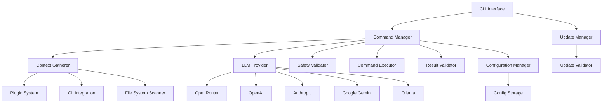

# Design Document

## Overview

The nl-to-shell utility is designed as a modular Go CLI application that converts natural language descriptions into executable shell commands using Large Language Models. The architecture emphasizes safety, extensibility, and cross-platform compatibility through a layered design with clear separation of concerns.

The system follows a pipeline architecture: Context Gathering → LLM Processing → Safety Validation → Command Execution → Result Validation, with each stage being independently testable and configurable.

## Architecture

### High-Level Architecture



### Core Components

1. **CLI Interface Layer**: Command-line argument parsing and user interaction
2. **Command Manager**: Central orchestrator for the command generation pipeline
3. **Context Gatherer**: Collects environmental context for enhanced command generation
4. **LLM Provider Interface**: Unified interface for multiple AI providers
5. **Safety Validator**: Analyzes commands for dangerous operations
6. **Command Executor**: Safely executes shell commands with proper isolation
7. **Result Validator**: Validates command results and suggests corrections
8. **Configuration Manager**: Handles persistent configuration and credentials
9. **Plugin System**: Extensible context providers
10. **Update Manager**: Handles automatic updates and version management

## Components and Interfaces

### CLI Interface

**Package**: `cmd/`

The CLI uses the Cobra framework for robust command-line parsing and follows Go CLI conventions.

```go
type CLIConfig struct {
    DryRun          bool
    Verbose         bool
    Provider        string
    Model           string
    SkipConfirmation bool
    SessionMode     bool
    ValidateResults bool
}

type CLI interface {
    Execute() error
    HandleInteractiveSession() error
    DisplayHelp() error
}
```

**Key Features**:
- Subcommands for different operations (generate, config, update, session)
- Global flags for common options
- Interactive session mode with persistent context
- Comprehensive help and usage information

### Command Manager

**Package**: `internal/manager/`

Central orchestrator that coordinates the entire command generation pipeline.

```go
type CommandManager struct {
    contextGatherer ContextGatherer
    llmProvider     LLMProvider
    safetyValidator SafetyValidator
    executor        CommandExecutor
    resultValidator ResultValidator
    config          *Config
}

type CommandManager interface {
    GenerateCommand(ctx context.Context, input string) (*CommandResult, error)
    ExecuteCommand(ctx context.Context, cmd *Command) (*ExecutionResult, error)
    ValidateResult(ctx context.Context, result *ExecutionResult, intent string) (*ValidationResult, error)
}
```

### Context Gatherer

**Package**: `internal/context/`

Collects environmental information to enhance command generation accuracy.

```go
type Context struct {
    WorkingDirectory string
    Files            []FileInfo
    GitInfo          *GitContext
    Environment      map[string]string
    PluginData       map[string]interface{}
}

type ContextGatherer interface {
    GatherContext(ctx context.Context) (*Context, error)
    RegisterPlugin(plugin ContextPlugin) error
}

type GitContext struct {
    IsRepository bool
    CurrentBranch string
    WorkingTreeStatus string
    HasUncommittedChanges bool
}
```

### LLM Provider Interface

**Package**: `internal/llm/`

Unified interface supporting multiple AI providers with consistent error handling and retry logic.

```go
type LLMProvider interface {
    GenerateCommand(ctx context.Context, prompt string, context *Context) (*CommandResponse, error)
    ValidateResult(ctx context.Context, command, output, intent string) (*ValidationResponse, error)
    GetProviderInfo() ProviderInfo
}

type ProviderInfo struct {
    Name         string
    RequiresAuth bool
    SupportedModels []string
}

// Concrete implementations
type OpenRouterProvider struct{}
type OpenAIProvider struct{}
type AnthropicProvider struct{}
type GeminiProvider struct{}
type OllamaProvider struct{}
```

**Provider Configuration**:
- Factory pattern for provider instantiation
- Configurable timeouts and retry policies
- Rate limiting and error handling
- Model-specific prompt optimization

### Safety Validator

**Package**: `internal/safety/`

Analyzes generated commands for potentially dangerous operations.

```go
type SafetyValidator interface {
    ValidateCommand(cmd *Command) (*SafetyResult, error)
    IsDangerous(cmd string) bool
    GetDangerousPatterns() []DangerousPattern
}

type SafetyResult struct {
    IsSafe       bool
    DangerLevel  DangerLevel
    Warnings     []string
    RequiresConfirmation bool
}

type DangerousPattern struct {
    Pattern     *regexp.Regexp
    Description string
    Level       DangerLevel
}

type DangerLevel int
const (
    Safe DangerLevel = iota
    Warning
    Dangerous
    Critical
)
```

**Safety Rules**:
- Pattern-based detection for dangerous commands
- Context-aware analysis (e.g., `rm` in different directories)
- User confirmation requirements based on danger level
- Bypass mechanisms for advanced users

### Command Executor

**Package**: `internal/executor/`

Safely executes shell commands with proper isolation and monitoring.

```go
type CommandExecutor interface {
    Execute(ctx context.Context, cmd *Command) (*ExecutionResult, error)
    DryRun(cmd *Command) (*DryRunResult, error)
}

type Command struct {
    Command     string
    Args        []string
    WorkingDir  string
    Environment map[string]string
    Timeout     time.Duration
}

type ExecutionResult struct {
    ExitCode    int
    Stdout      string
    Stderr      string
    Duration    time.Duration
    Error       error
}
```

### Configuration Manager

**Package**: `internal/config/`

Handles persistent configuration storage and credential management.

```go
type Config struct {
    DefaultProvider string
    Providers       map[string]ProviderConfig
    UserPreferences UserPreferences
    UpdateSettings  UpdateSettings
}

type ProviderConfig struct {
    APIKey      string
    BaseURL     string
    DefaultModel string
    Timeout     time.Duration
}

type ConfigManager interface {
    Load() (*Config, error)
    Save(config *Config) error
    GetProviderConfig(provider string) (*ProviderConfig, error)
    SetupInteractive() error
}
```

**Configuration Storage**:
- Cross-platform configuration directories
- Secure credential storage using system keychain when available
- Configuration migration for version updates
- Environment variable overrides

### Plugin System

**Package**: `internal/plugins/`

Extensible system for custom context providers.

```go
type ContextPlugin interface {
    Name() string
    GatherContext(ctx context.Context, baseContext *Context) (map[string]interface{}, error)
    Priority() int
}

type PluginManager interface {
    RegisterPlugin(plugin ContextPlugin) error
    LoadPlugins(pluginDir string) error
    GetPlugins() []ContextPlugin
}
```

**Built-in Plugins**:
- Environment variable collector
- Development tool detector (Docker, Node.js, Python, etc.)
- Project type identifier
- Language-specific context gatherers

### Update Manager

**Package**: `internal/updater/`

Handles automatic updates and version management.

```go
type UpdateManager interface {
    CheckForUpdates(ctx context.Context) (*UpdateInfo, error)
    PerformUpdate(ctx context.Context, updateInfo *UpdateInfo) error
    GetCurrentVersion() string
}

type UpdateInfo struct {
    Available       bool
    LatestVersion   string
    CurrentVersion  string
    ReleaseNotes    string
    DownloadURL     string
    Checksum        string
}
```

## Data Models

### Core Data Structures

```go
// Command represents a shell command to be executed
type Command struct {
    ID          string
    Original    string    // Original natural language input
    Generated   string    // Generated shell command
    Validated   bool      // Whether it passed safety validation
    Context     *Context  // Context used for generation
    Timestamp   time.Time
}

// CommandResult represents the complete result of command generation
type CommandResult struct {
    Command     *Command
    Safety      *SafetyResult
    Confidence  float64
    Alternatives []string
}

// ExecutionResult represents the result of command execution
type ExecutionResult struct {
    Command     *Command
    ExitCode    int
    Stdout      string
    Stderr      string
    Duration    time.Duration
    Success     bool
    Error       error
}

// ValidationResult represents AI validation of execution results
type ValidationResult struct {
    IsCorrect     bool
    Explanation   string
    Suggestions   []string
    CorrectedCommand string
}
```

### Configuration Data Models

```go
// UserPreferences stores user-specific settings
type UserPreferences struct {
    SkipConfirmation    bool
    VerboseOutput       bool
    DefaultTimeout      time.Duration
    MaxFileListSize     int
    EnablePlugins       bool
    AutoUpdate          bool
}

// UpdateSettings controls update behavior
type UpdateSettings struct {
    AutoCheck           bool
    CheckInterval       time.Duration
    AllowPrerelease     bool
    BackupBeforeUpdate  bool
}
```

## Error Handling

### Error Types

```go
type ErrorType int
const (
    ErrTypeValidation ErrorType = iota
    ErrTypeProvider
    ErrTypeExecution
    ErrTypeConfiguration
    ErrTypeNetwork
    ErrTypePermission
)

type NLShellError struct {
    Type    ErrorType
    Message string
    Cause   error
    Context map[string]interface{}
}
```

### Error Handling Strategy

1. **Graceful Degradation**: System continues operating with reduced functionality when non-critical components fail
2. **Retry Logic**: Automatic retries for transient failures (network, provider timeouts)
3. **User-Friendly Messages**: Clear, actionable error messages for end users
4. **Logging**: Structured logging for debugging and monitoring
5. **Recovery**: Automatic recovery mechanisms where possible

## Testing Strategy

### Unit Testing

- **Coverage Target**: 90% code coverage for core components
- **Mocking**: Mock interfaces for external dependencies (LLM providers, file system)
- **Test Data**: Comprehensive test cases for different command types and contexts
- **Edge Cases**: Extensive testing of error conditions and edge cases

### Integration Testing

- **Provider Testing**: Integration tests with actual LLM providers (using test accounts)
- **Command Execution**: Safe integration tests for command execution
- **Configuration**: Testing configuration loading and saving across platforms
- **Plugin System**: Testing plugin loading and context gathering

### End-to-End Testing

- **CLI Testing**: Complete CLI workflow testing using test harnesses
- **Cross-Platform**: Automated testing on Linux, macOS, and Windows
- **Safety Testing**: Verification that dangerous commands are properly blocked
- **Update Testing**: Testing update mechanisms in controlled environments

### Performance Testing

- **Response Time**: Measuring command generation latency
- **Memory Usage**: Monitoring memory consumption during operation
- **Concurrent Operations**: Testing behavior under concurrent requests
- **Large Context**: Testing with large file listings and complex git repositories

## Security Considerations

### Credential Security

- **Storage**: Use system keychain/credential store when available
- **Transmission**: HTTPS for all API communications
- **Access**: Minimal privilege principle for file system access
- **Rotation**: Support for API key rotation

### Command Safety

- **Validation**: Multi-layer validation before command execution
- **Sandboxing**: Consider containerized execution for high-risk commands
- **Logging**: Audit trail of all generated and executed commands
- **User Control**: Always require explicit user consent for execution

### Data Privacy

- **Context Filtering**: Avoid sending sensitive information to cloud providers
- **Local Processing**: Prefer local models when privacy is critical
- **Data Retention**: No persistent storage of user commands or context
- **Anonymization**: Remove PII from any telemetry or error reporting

## Deployment and Distribution

### Build System

- **Go Modules**: Use Go modules for dependency management
- **Cross-Compilation**: Build binaries for all target platforms
- **Static Linking**: Minimize external dependencies
- **Reproducible Builds**: Ensure consistent builds across environments

### Distribution Channels

1. **GitHub Releases**: Primary distribution with automated releases
2. **Package Managers**: Homebrew (macOS), APT/YUM (Linux), Chocolatey (Windows)
3. **Container Images**: Docker images for containerized environments
4. **Source Distribution**: Source code with build instructions

### Installation Methods

1. **Installer Scripts**: Platform-specific installation scripts
2. **Binary Downloads**: Direct binary downloads with verification
3. **Package Managers**: Native package manager integration
4. **Source Compilation**: Go build instructions for source installation

## Performance Optimization

### Caching Strategy

- **Context Caching**: Cache file system scans and git information
- **Provider Response Caching**: Cache similar requests to reduce API calls
- **Configuration Caching**: In-memory configuration caching
- **Plugin Result Caching**: Cache plugin context gathering results

### Resource Management

- **Memory Management**: Efficient memory usage with proper cleanup
- **Goroutine Management**: Controlled concurrency for parallel operations
- **File Handle Management**: Proper file handle cleanup
- **Network Connection Pooling**: Reuse HTTP connections for API calls

### Scalability Considerations

- **Concurrent Requests**: Support for multiple simultaneous operations
- **Large Repositories**: Efficient handling of large git repositories
- **Plugin Scalability**: Plugin system that doesn't degrade performance
- **Update Scalability**: Efficient update distribution and installation